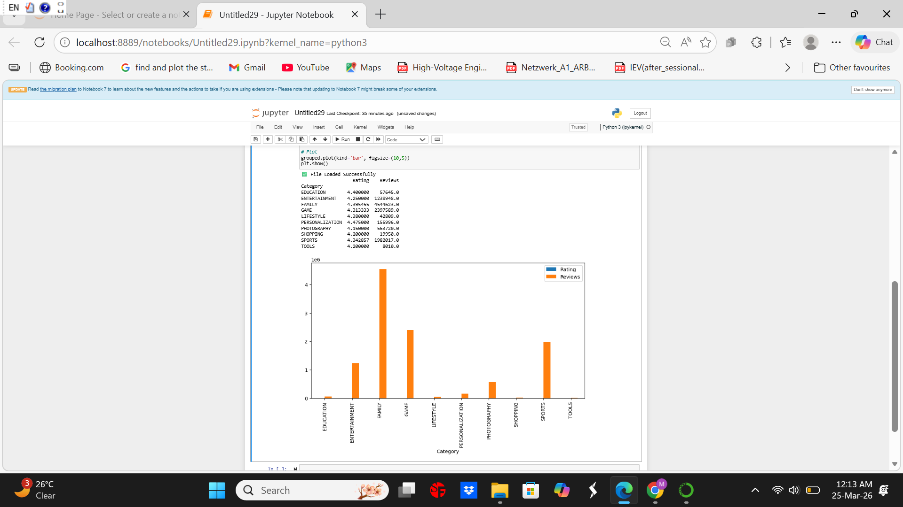

# Google-Play-store-data-analytics---python

## 🎯 Objective
Analyze top 10 app categories based on installs and compare:
- Average Rating
- Total Reviews

##  Dataset
Google Play Store Dataset

## Filters Applied
- Rating ≥ 4.0
- Size ≥ 10 MB
- Last Updated: January

## Features
- Grouped Bar Chart
- Top 10 Categories by Installs
- Data Cleaning & Preprocessing

## Tools Used
- Python
- Pandas
- Matplotlib
- Jupyter Notebook

## Output

## Process
1. Data cleaning
2. Filtering
3. Aggregation
4. Visualization
